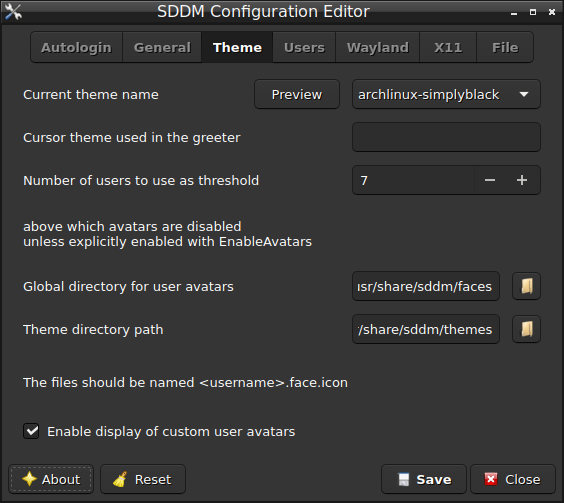

# sddm-conf

## Overview

Configuration editor for [SDDM][1] similar to [sddm-config-editor][2],
but written in C++.



## Dependencies

Runtime:

- SDDM
- Qt5 base
- [polkit][3] (to save the settings)

Build:

- CMake
- Qt5 Linguist Tools
- [Qtilitools][4] CMake modules
- Git (optional, to pull latest VCS checkouts)

## Build

`CMAKE_BUILD_TYPE` is usually set to `Release`, though `None` might be a [valid alternative][5].<br>
`CMAKE_INSTALL_PREFIX` has to be set to `/usr` on most operating systems.

```bash
cmake -B build -D CMAKE_BUILD_TYPE=Release -D CMAKE_INSTALL_PREFIX=/usr -W no-dev
cmake --build build --verbose
DESTDIR="$(pwd)/package" cmake --install build
```

## Packages

[][6]

## Translations

Translations can be done in [LXQt-Weblate][7].

[][8]


[1]: https://github.com/sddm/sddm/
[2]: https://github.com/lxqt/sddm-config-editor/
[3]: https://gitlab.freedesktop.org/polkit/polkit/
[4]: https://github.com/qtilities/qtilitools/
[5]: https://wiki.archlinux.org/title/CMake_package_guidelines#Fixing_the_automatic_optimization_flag_override
[6]: https://repology.org/project/sddm-conf/versions
[7]: https://translate.lxqt-project.org/projects/qtilities/sddm-conf/
[8]: https://translate.lxqt-project.org/engage/qtilities/?utm_source=widget
